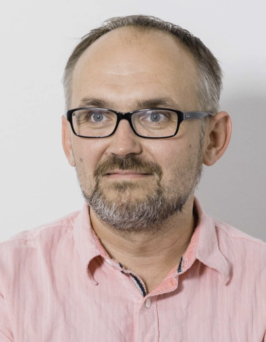

# Kurt Stieger
- Software Engineer
- Linux enthusiast
- team player
- ... with a passion for open source software projects.

## Contact
- [LinkedIn](https://at.linkedin.com/in/kurt-stieger-3884b4a9)
- [Xing](https://www.xing.com/profile/Kurt_Stieger)

## Currently

Working as a software engineer at PROLICHT GmbH, a company that develops and produces high quality LED lighting systems.
My main focus is on the development of the software which interfafes data from the ERP system with the online shop and the production machines.

## Interests

Linux and the super powers it gives you, open source software, programming, electronics, 3D printing.
Coding software in Go or Python, with focus on clean code and observability.
In my spare time I like skiing, biking and hiking.

## Experience

### Software Engineer at PROLICHT GmbH, Götzens
`2023-08 - present`
- Development of software for interfacing data from the ERP system with the company website and the production machines.
- Development of a REST API for the company website.
- Development of tools for deployment and monitoring of hosted services.

### Embeded Software Engineer at Controllino GmbH, Innnsbruck
`2022-04 - 2023-07`
- Development of manufacturing software for the Controllino PLCs.
- Operating system, monitoring and deployment of the Controllino Helium Gateway.
- Development of an Over-The-Air update system for Controllino devices.

### Software Escalation Enginer, Barracuda Networks AG, Innsbruck
`2020-01 - 2022-03`
- Escalation engineer for the Barracuda CloudGen Firewall.
- Development of tools for the support team.
- Reproduction and analysis of customer issues.
- Automated rebuilding customer environments for testing and debugging.

### Software Quality Assurance Engineer, Barracuda Networks AG, Innsbruck
`2018-09 - 2019-12`
- Development of automated tests for the Barracuda CloudGen Firewall.
- Implementing KVM based virtualized test environments.
- Managing test environments with Ansible, Docker, Terraform, ...

### IT System Administrator, ESR Labs AG, Munich
`2017-03 - 2018-08`
- Administration of the IT infrastructure.
- Virtualization with KVM and Docker.
- Implementing Asset Management.

### Software Quality Assurance Engineer, Barracuda Networks AG, Innsbruck
`2013-01 - 2017-02`
- Development of automated tests for the Barracuda CloudGen Firewall.
- Manual testing of the Barracuda CloudGen Firewall.
- Implement different test environments for the Barracuda CloudGen Firewall. In Hardware, Virtualized and Cloud based.

### IT Technician, Hotze.com GmbH, Innsbruck
`2012-10 - 2012-12`
- Customer support and IT administration.

### IT Administrator, Regionalmedien Austria AG, Innsbruck
`2001-09 - 2012-09`
- Administration of the IT infrastructure.
- Deployment of internal and external services.
- Asset Management.
- Infrastructure planning and implementation.
- Monitoring and troubleshooting.

### DTP Operator, Regionalmedien Austria AG, Innsbruck
`1999-07 - 2001-08`
- Layout and production of print media.

### DTP Technician, Konsumgennossenschaft Salzkammergut, Bad Goisern
`1995-06 - 1999-06`
- Layout and production of addvertisements and print media.

## Education

### Apprentice retail merchant and first carreer steps, Konsumgennossenschaft Salzkammergut, Bad Goisern
`1988-07 - 1999-06`

## Skills
`Automation` | `Go` | `Python` | `Linux` | `Git` | `Docker` | `Bash` | `HTML` | `CSS` | `JavaScript` | `Vue.js` | `React` | `SQL` | `PostgreSQL` | `MySQL` | `MongoDB` | `RabbitMQ` | `NATS` | `REST` | `HAProxy` | `Gitlab` | `Ansible` | `Podman` | `Ruby` | `KVM` | `SNMP` | `Networking` | `Routing` | `Scrum` | `WireGuard`

## Languages
- German: native
- English: good
